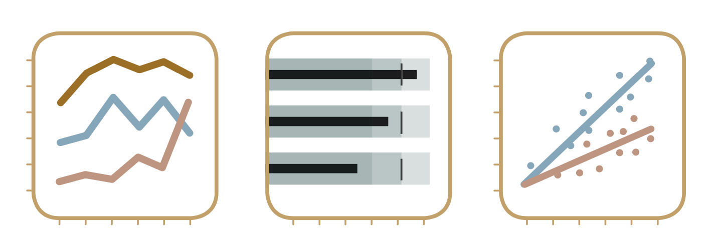

## What this course is about

## Example Dashboard 1

## Example Dashboard 2

## Example Dashboard 3

## Example Dashboard 4

## Example Dashboard 5

## What is a Dashboard?

- Dashboards provide a visual display of the most important information needed to achieve one or more objectives.
- They consolidate and arrange information on a single screen.

## Key Characteristics of Effective Dashboards

- **Clarity**: Information should be easy to read and interpret.
- **Accuracy**: Data must be accurate and up-to-date.
- **Relevance**: Content should align with user goals and needs.

## The Role of Visual Design

- Minimize distractions and unnecessary elements.
- Use consistent layouts and formatting.
- Apply thoughtful use of color and typography.

## Best Practices for Dashboard Design

- **Avoid clutter**: Only display essential information.
- **Prioritize data**: Highlight key metrics and KPIs.
- **Use visual hierarchy**: Direct the viewer's focus to the most important elements.

## Common Pitfalls to Avoid

- Overloading the user with too much data.
- Using overly complex or inconsistent designs.
- Neglecting the importance of user testing.

## A User-Centric Approach

- Focus on the needs and goals of the dashboard's end-users.
- Iteratively test and refine designs to improve usability.

## Summary

- Dashboards are powerful tools for decision-making.
- Effective dashboards balance clarity, relevance, and visual appeal.
- Avoid common pitfalls by focusing on user needs and testing designs.
